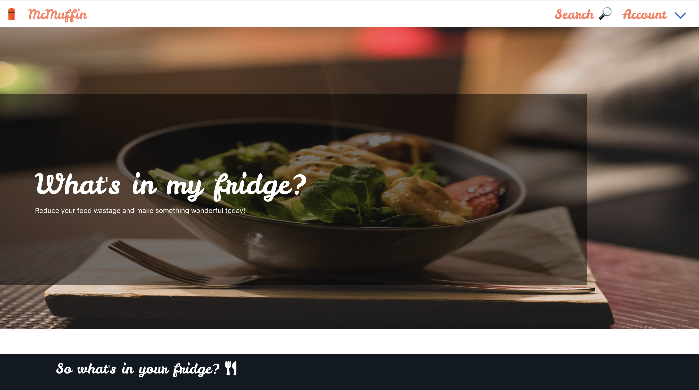

# GA WDI-34  Project #3: A MEAN stack Application

## 'What's in your fridge?'

##### Group project by Linda Le, Rachel Dolan and Natasha Ramburrun.
Visit app which is deployed on [Heroku](https://what-is-in-your-fridge.herokuapp.com/)

Design and build a MEAN stack app (MongoDB, Express, Angular, Node.js) with:

#### Requirements (Brief)

Your app must:

* **Your API must have at least 2 related  models**, one of which should be a user
* A handmade Angular front-end **that consumes your own API**, hosted somewhere on the internet
* **Use Mongo, Node & Express** to build a server-side API
* Include **authentication** to restrict   access to appropriate users
* Your API should include **all RESTFUL  actions** for at least one of those models
* **Use SCSS instead of CSS**
* A **link to your hosted working app** in the URL section of your Github repo
* A **team git repository hosted on Github**, with a link to your hosted project, and frequent commits from _every_ team member dating back to the _very beginning_ of the project
* A **working API, built by the whole team**, hosted somewhere on the internet

<hr/>

#### Technologies Used
HTML | SCSS | JavaScript (ES6) | MongoDB | Express | Angular | Node.js | Webpack | Mongoose | [Draw.io](https://www.draw.io) | [Trello](https://trello.com)

<hr/>

#### Overview
The requirement for the third WDI project was for groups in the class to team up and work collaboratively to build a MEAN Stack Application using Node.js, Express and AngularJS. We decided on an app which allows you to list the ingredients you have at home to find a recipe.

<strong>Home Page</strong>:
<p align="center"></p>

<hr/>

#### Planning and Design
We successfully planned the project using the project management tool Trello. The team identified what we would like the app to feature using whiteboards and a brainstorm and then completed the wireframe using Draw.io to help highlight the users experience.  

<strong>Wireframe</strong>:
<p align="center"></p>

<strong>Planning</strong>: We used Trello as our planning and organisation tool guiding the team through the tasks status. The team communicated regularly on slack and worked in close proximity during the course of the project.
<p align="center"></p>

<hr/>

#### The build

For the build process we used the food, recipe and nutrition API Spoonacular. Using this API allowed us to search by ingredients and list all the relevant recipes. We also implemented a functionality where we could filter by the diet requirement and included an autocomplete functionality where a list of choices is populated for the user to select from.

<strong>Search Page</strong>: The main feature of this project is for the user to search by ingredients rather then recipes, therefore we decided only have an index of ingredients input in the search bar.
<p align="center"></p>

CODE: We built the app so when ingredients are selected they are pushed into an array then are populated into the recipes. The user can also delete the ingredients where the item is then spliced to be removed from the array. See the code below:

```
$scope.setIngredient = function(suggestion){
  $scope.ingredients.push(suggestion.name);
  $scope.ingredient = '';
  $scope.suggestions = [];
};

$scope.deleteIngredient = function(ingredient){
  const index = $scope.ingredients.indexOf(ingredient);
  $scope.ingredients.splice(index, 1);
};

```
<strong>Recipes Show Page</strong>: The user can view the recipe via the API server and retrieving the recipe information such as instructions and cooking times.

We included additional features such as create and delete comments/ratings and favourite and unfavourite recipes. As recipes are not stored on our local mongo db storage we store the comments against the API Spoonacular Id and recipe Id.

<p align="center"></p>

The app is fully RESTful and the user can register and login with authentication. Once logged on the user is able to access their profile page which they can edit and include their information or delete removing from our database.

<strong>Profile Page</strong>: We used Filepicker API to include a photo uploader making it simple for users to add a picture.
<p align="center"></p>

<hr/>

 #### Challenges

 We encountered some challenges with the consistency of data being return back from the API, results would be incorrect and sometimes unrelated to food.

 <hr/>

 #### Future development

 - A separate index page with all recipes.
 - complete the rating system by including a total star rating on the recipe page calculating algorithm of average star rating.
 - Be able to view other members profiles to see what recipes they have favourite.
 - Be able to load pictures of the dish they replicated from the recipe provided by the API.
